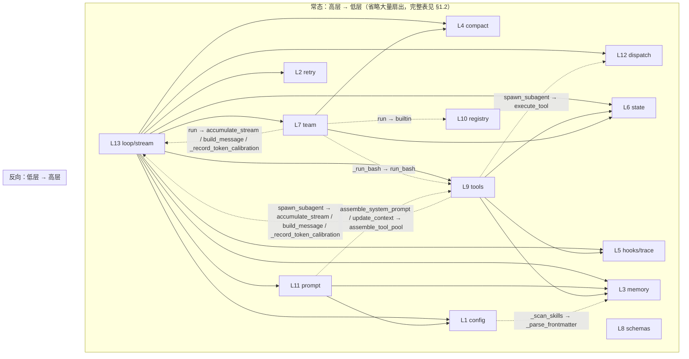

# 2026-08-20 拆包探针（只读）

> **性质**：给所有者做裁定用的材料。本文不给「拆 / 不拆」的结论。
> **仓库 / HEAD**：`python-claude-harness` `6a59b5a`（139 tests collected）。
> **被分析文件**：`examples/22_trunk.py` 4123 行。层边界以源码里的 `【第 N 层】` 为准（当前行号见 §0），不以 README 代码地图为准（那张表是 2026-08-16 的行号快照）。
> **方法**：对 `22_trunk.py` 做 AST 调图 + 全仓 grep（不带 `head`）+ 读函数体核对。AST 把局部变量 `handler` 误解析成 `_make_mcp_handler.handler` 的边已剔除（见 §1.4）。
> **BACKLOG 记载与代码不符处**：以代码为准，集中写在 §0.2，后文不再当新发现重复报。

---

## 0. 层边界与记载偏差（后文行号都相对这里）

| 层 | 标记行 | 止于 | 行数 | 标记写的职责 |
|---|---:|---:|---:|---|
| L1 | 38 | 250 | 213 | 配置 · 常量 · 开关 |
| L2 | 251 | 343 | 93 | 错误恢复 |
| L3 | 344 | 636 | 293 | 记忆系统 |
| L4 | 637 | 807 | 171 | 上下文管理 / compact |
| L5 | 808 | 1070 | 263 | hooks · 权限 · 轨迹 |
| L6 | 1071 | 1554 | 484 | 任务 / worktree / cron |
| L7 | 1555 | 2151 | 597 | 团队协作 |
| L8 | 2152 | 2314 | 163 | 工具参数 schema（无顶层函数） |
| L9 | 2315 | 3156 | 842 | 工具实现 |
| L10 | 3157 | 3339 | 183 | 工具注册表 · 工具池组装 |
| L11 | 3340 | 3451 | 112 | prompt 组装 · 上下文状态 |
| L12 | 3452 | 3579 | 128 | 工具分发执行 · 后台任务 |
| L13 | 3580 | 4123 | 544 | 会话 · 流式 · agent loop · 入口 |
| 文首 | 1 | 37 | 37 | 模块 docstring + import |

标记和函数体错位（按标记切文件时，这些名字会落到「职责注释说的那一层」的外面）：

| 名字 | 定义行 | 按标记所属 | 注释声称的层 |
|---|---:|---|---|
| `HOOKS` | 804 | L4 末尾（L5 标记在 808） | L5 |
| `assemble_tool_pool` | 3126 | L9 末尾（L10 标记在 3157） | L10「工具池组装」 |
| `_bg_counter` / `background_tasks` / `background_results` / `background_lock` | 3445-3448 | L11 末尾 | L12 后台任务 |
| `session_context` / `session_history` | 3575-3576 | L12 末尾 | L13 会话 |

L12 层头注释（3453 行）写的是 `execute_tool(校验参数 → 触发 hooks → 调 handler)`。函数体 `execute_tool:3487-3518` **没有**调用 `trigger_hook`。hooks 发生在调用方，见 §2.1。

---

### 0.2 BACKLOG 记载 vs 代码（以代码为准）

| BACKLOG 写法 | 代码事实 |
|---|---|
| `_hooks` | 没有这个名字。表叫 `HOOKS`（804） |
| `registry` | 没有这个模块级名。内置表叫 `TOOL_REGISTRY`（3176）；另有函数内局部名 `sub_tool_registry`（1835）、`sub_registry`（2708）、`TOOLS_Registry`（3601） |
| `execute_tool` 调 handler → handler 用 hooks → hooks 用 trace | **不是静态环，也不是 `execute_tool` 内部的调用链**。见 §2 |
| `tests/conftest.py` 上挂 **100** 条测试 | `uv run pytest --collect-only`：**139 collected**。conftest 自己的 docstring（19 行）还写着「2003 行只装一次」，那是 `21_mcp_real.py` 的行数 |
| `22` 是 `21` 的可 import 副本、「其余逐字未动」 | `21_mcp_real.py` 2003 行 / 74 个顶层函数；`22_trunk.py` 4123 行 / 149 个顶层函数。22 比 21 多 76 个顶层函数，21 里有而 22 没有的顶层函数只剩 `is_slow_operation` |

---

## 1. 真实依赖图

节点 = 13 层。边 = 跨层的**顶层/嵌套函数调用**（同一层内部调用不画）。方向：`A → B` 表示 A 里的函数调用了 B 里的函数。

本文件的编号是 L1 在底（配置）、L13 在顶（循环）。**高层调低层是常态**（L13 直接用 L1–L12 的几乎每一层）。拆包痛点是另一头：**低编号层调用高编号层**，见 §1.3。



L8 零顶层函数，只有 Pydantic 类。L10 `TOOL_REGISTRY = {..., builtin(..., run_bash), ...}` 是**模块加载时的名字绑定**，不是运行期 `Call`；图里没画「L10 → L7/L8/L9」，但若按层切成文件，`registry.py` 必须 import 全部 handler 与 schema。见 §2.3。

### 1.1 谁调谁（层 × 层，唯一函数对）

只列跨层。`SKIP` = 不相邻。

**A. 低编号 → 高编号（反向，拆文件时的 import 痛点）**

| 边 | 相邻? | 函数对（调用点行号） |
|---|---|---|
| L1 → L3 | SKIP | `_scan_skills:89` → `_parse_frontmatter:352` @ 98 |
| L7 → L4 | SKIP | `spawn_teammate_thread.run:1823` → `_is_tool_result_message:651` @ 1957 |
| L7 → L6 | 相邻 | `idle_poll:1719` → `claim_task:1148` @ 1747；`scan_unclaimed_tasks:1706` → `can_start:1136` @ 1713；`run._run_list_tasks:1864` → `list_tasks:1120` @ 1865；`run._run_claim_task:1874` → `claim_task:1148` @ 1875、`load_task:1126` @ 1878；`run._run_complete_task:1885` → `complete_task:1174` @ 1886 |
| L7 → L9 | SKIP | `run._run_bash:1830` → `run_bash:2376` @ 1831 |
| L7 → L10 | SKIP | `run:1823` → `builtin:3172` @ 1836, 1837, 1842, 1847, 1852, 1857（teammate 自建 `sub_tool_registry`，不走 `TOOL_REGISTRY`） |
| L7 → L13 | SKIP | `run:1823` → `accumulate_stream:3616` @ 1974；→ `build_message:3644` @ 1979；→ `_record_token_calibration:3680` @ 1975 |
| L9 → L12 | SKIP | `spawn_subagent:2691` → `execute_tool:3487` @ 2758 |
| L9 → L13 | SKIP | `spawn_subagent:2691` → `accumulate_stream:3616` @ 2745；→ `build_message:3644` @ 2747；→ `_record_token_calibration:3680` @ 2746 |
| L11 → L9 | SKIP | `assemble_system_prompt:3347` → `assemble_tool_pool:3126` @ 3359；`update_context:3415` → `assemble_tool_pool:3126` @ 3438 |

**B. 高编号 → 低编号（常态扇出；L13 几乎点名所有层）**

| 边 | 相邻? | 函数对（调用点行号） |
|---|---|---|
| L9 → L3 | SKIP | `run_memory_create:2550` / `run_memory_str_replace:2560` / `run_memory_insert:2586` / `run_memory_delete:2601` / `run_memory_rename:2617` → `_rebuild_index:365` @ 2556, 2575, 2597, 2613, 2630 |
| L9 → L5 | SKIP | `spawn_subagent:2691` → `trigger_hook:821` @ 2754（PreToolUse）、2766（PostToolUse） |
| L9 → L6 | SKIP | `run_create_task:2780` → `create_task:1101` @ 2783；`run_list_tasks:2789` → `list_tasks:1120` @ 2790；`run_get_task:2802` → `get_task:1130` @ 2804；`run_claim_task:2809` → `claim_task:1148` @ 2814；`run_complete_task:2819` → `complete_task:1174` @ 2821；`run_schedule_cron:2826` → `schedule_job:1471` @ 2829；`run_cancel_cron:2848` → `cancel_job:1493` @ 2849；`run_create_worktree:2852` → `create_worktree:1236` @ 2853；`run_remove_worktree:2856` → `remove_worktree:1286` @ 2857；`run_keep_worktree:2860` → `keep_worktree:1320` @ 2861 |
| L11 → L1 | SKIP | `update_context:3415` → `list_skills:110` @ 3441 |
| L11 → L3 | SKIP | `update_context:3415` → `load_memories:495` @ 3429 |
| L13 → L1 | SKIP | `init_session:3590` → `_scan_skills:89` @ 3593；`agent_loop:3777` → `_usage_cached_tokens:209` @ 3841、`_usage_cached_field_present:223` @ 3842 |
| L13 → L2 | SKIP | `agent_loop:3777` → `with_retry:280` @ 3836、`is_prompt_too_long_error:332` @ 3855 |
| L13 → L3 | SKIP | `agent_loop:3777` → `extract_memories:510` @ 3892、`consolidate_memories:570` @ 3893 |
| L13 → L4 | SKIP | `agent_loop:3777` → `tool_result_budget:734` @ 3800、`snip_compact:678` @ 3803、`micro_compact:713` @ 3806、`reactive_compact:791` @ 3863；`try_compact:3756` → `compact_history:783` @ 3766；`main:4073` → `ensure_dirs:659` @ 4090 |
| L13 → L5 | SKIP | `agent_loop:3777` → `trigger_hook:821` @ 3890, 3930, 3941, 3959, 3985；`run_agent_turn_locked:4022` → `trigger_hook:821` @ 4027, 4032 |
| L13 → L6 | SKIP | `run_agent_turn_locked:4022` → `consume_cron_queue:1533` @ 4030；`queue_processor_loop:4056` → `has_cron_queue:1541` @ 4060, 4065；`main:4073` → `start_cron_scheduler:1547` @ 4103 |
| L13 → L7 | SKIP | `run_agent_turn_locked:4022` → `consume_lead_inbox:1665` @ 4042 |
| L13 → L9 | SKIP | `assemble_tools:3600` → `assemble_tool_pool:3126` @ 3601；`main:4073` → `stop_sandbox:2368` @ 4119 |
| L13 → L11 | SKIP | `init_session:3590` → `update_context:3415` @ 3594、`get_system_prompt:3379` @ 3596；`agent_loop:3777` → `update_context:3415` @ 3786, 3981、`assemble_system_prompt:3347` @ 3788, 3982；`run_agent_turn_locked:4022` → `update_context:3415` @ 4040 |
| L13 → L12 | 相邻 | `agent_loop:3777` → `should_run_background:3460` @ 3944、`start_background_task:3521` @ 3945、`execute_tool:3487` @ 3958、`collect_background_results:3546` @ 3971 |

不相邻的跨层调用（双向合计）：上表除「L7→L6」「L13→L12」外全部是 SKIP。相邻的跨层函数调用全文件只有这两条边。13 层在文件里是排好队的，**调用关系不是一层只碰邻居**。

### 1.2 L13 主循环实际串起来的层

`agent_loop:3777` 一轮里按源码顺序碰到的外层函数：

1. `update_context`（L11:3415）→ 内部再调 `load_memories`（L3）、`assemble_tool_pool`（物理 L9:3126）、`list_skills`（L1）
2. `assemble_system_prompt`（L11:3347）
3. `assemble_tools`（L13:3600）→ `assemble_tool_pool`
4. `tool_result_budget` / `snip_compact` / `micro_compact` / `try_compact`（L4 + L13）
5. `with_retry` + `accumulate_stream`（L2 + L13）
6. 无工具：`trigger_hook("Stop")`（L5）+ `extract_memories` / `consolidate_memories`（L3）
7. 有工具：`trigger_hook("PreToolUse")`（L5:3930）→ 可选 `start_background_task`（L12）或 `execute_tool`（L12:3958）→ `trigger_hook("PostToolUse")`（L5:3959）
8. `collect_background_results`（L12）后再次 `update_context` / `assemble_system_prompt`

这是运行期管道，不是模块 import 环。

### 1.4 AST 剔除的假边

局部名 `handler = entry.handler` 被解析成模块里的 `_make_mcp_handler.handler:3120`：

- `spawn_teammate_thread.run` 2026 / 2029（真实是 `sub_tool_registry` 里的闭包）
- `execute_tool` 3516（真实是 `TR.get(...).handler`，运行期字典）

这两条**不构成** L7→L9 MCP、L12→L9 的静态调用。`execute_tool` 对 L9 handler 的依赖是 `TOOL_REGISTRY` / 传入的 `TR` 字典，切文件后变成「dispatch 不 import 具体工具」或「registry 一处 import 全部 handler」。

---

## 2. 循环依赖（落到函数）

### 2.1 BACKLOG 那条链在代码里的形状

函数级 Tarjan：`22_trunk.py` **没有多节点 SCC**。自递归只有 `_cron_field_matches:1352`、`_validate_cron_field:1392`、`MCPStdioClient.close`。

`execute_tool:3487-3518` 的实际身体：

1. `TR.get(tc.function.name)`（3489）
2. validator / `json.loads`（3493-3502）
3. `handler = entry.handler`（3503）
4. `return handler(**args)`（3516）

全程 **零次** `trigger_hook` / `HOOKS` / `_trace_events`。

`trigger_hook` 的**全部**调用点（grep 全文件）：

| 调用方 | 层 | 行 | 事件 |
|---|---|---:|---|
| `spawn_subagent` | L9 | 2754 | PreToolUse |
| `spawn_subagent` | L9 | 2766 | PostToolUse |
| `agent_loop` | L13 | 3890, 3985 | Stop |
| `agent_loop` | L13 | 3930 | PreToolUse |
| `agent_loop` | L13 | 3941, 3959 | PostToolUse |
| `run_agent_turn_locked` | L13 | 4027, 4032 | UserPromptSubmit |

没有任何 L9 工具 handler（`run_bash` / `run_read` / `run_write` / `run_memory_*` / `load_skill` / …）调用 `trigger_hook`。

hooks → trace 也不是「hooks 模块 import trace 模块」。trace 是 **HOOKS 表里的回调**：

```
register_hook(...) 模块级 1060-1067
  UserPromptSubmit: context_inject_hook:843, trace_prompt_hook:1002
  PreToolUse:       trace_pre_hook:946, log_hook:829, permission_hook:892
                    （顺序有语义：821-825 遇到第一个非 None 就 return）
  PostToolUse:      trace_post_hook:977
  Stop:             trace_stop_hook:1009, summary_hook:849
```

主循环上这条链的真实顺序（`agent_loop` 3929-3959）：

```
agent_loop:3930  trigger_hook("PreToolUse", name, args)
                 → HOOKS["PreToolUse"] 顺序跑 trace_pre_hook → log_hook → permission_hook
agent_loop:3958  execute_tool(tc, TOOLS_Registry)
                 → 某个 L9 handler(**args)
agent_loop:3959  trigger_hook("PostToolUse", name, result)
                 → trace_post_hook
```

单文件里这是同一命名空间的线性管道。切成 `dispatch.py` / `tools.py` / `hooks.py` / `trace.py` 之后：

- `dispatch.execute_tool` **不必** import hooks 或 trace
- `loop.agent_loop` 和 `tools.spawn_subagent` **必须** import `trigger_hook`
- `trace_*_hook` import `register_hook`（或由 wiring 模块代注册）是单向的
- handler 继续不 import hooks

所以 BACKLOG 写的那条「环」，按静态 import 计 = **0 个环**。它描述的是运行顺序，不是 `import` 环。

### 2.2 按 13 层切文件后会出现的静态环

把每层收成一个模块、层内函数互相 import 顶层名，Tarjan 收缩后的多节点层 SCC 是：

**`{L7, L9, L11, L13}`**（L12 不进这个 SCC：`execute_tool` 不静态 import handler。）

拆成两条函数环：

**环 A — 流式三件套（最短，两边共用同一组叶子函数）**

```
L7  spawn_teammate_thread.run:1823
      → L13 accumulate_stream:3616 @ 1974
      → L13 build_message:3644     @ 1979
      → L13 _record_token_calibration:3680 @ 1975
L13 run_agent_turn_locked:4022
      → L7  consume_lead_inbox:1665 @ 4042
```

再加对称的一条：

```
L9  spawn_subagent:2691
      → L13 accumulate_stream:3616 @ 2745
      → L13 build_message:3644     @ 2747
      → L13 _record_token_calibration:3680 @ 2746
L13 assemble_tools:3600
      → L9  assemble_tool_pool:3126 @ 3601
```

打断点（把哪几个函数抽到双方都能 import 的叶子模块，两条环上的「L7/L9 → L13」边同时消失）：

| 抽出的函数 | 现层 | 行 |
|---|---|---:|
| `accumulate_stream` | L13 | 3616-3641 |
| `build_message` | L13 | 3644-3661 |
| `_record_token_calibration` | L13 | 3680-3696 |
| 若校准要跟秤走，一并 | `_chars_of:3671` / `estimate_tokens:3675` / `summarize_token_calibration:3698` / `_install_nonstream_calibration:3712` | |

抽出后剩余单向边：`L13 → L7 consume_lead_inbox`、`L13 → L9 assemble_tool_pool`，不再成环。`spawn_subagent → execute_tool` 仍是 L9 → L12 单向。

**环 B — 注册表晚绑定（`assemble_tool_pool` × `spawn_subagent` × `TOOL_REGISTRY`）**

物理位置：

- `assemble_tool_pool:3126` 在 L9 段
- `TOOL_REGISTRY:3176` 在 L10 段，其中 `"spawn_subagent": builtin(..., spawn_subagent)` 在 3300-3306
- `spawn_subagent:2691` 在 L9，函数里 `assemble_tool_pool().items()` 在 2708-2711
- `update_context:3415`（L11）@ 3438 也调 `assemble_tool_pool`
- `assemble_system_prompt:3347`（L11）@ 3359 同样

切文件后典型 import：

```
tools.py        (L9, 含 spawn_subagent)  --import-->  registry.py.assemble_tool_pool
registry.py     (L10, TOOL_REGISTRY)     --import-->  tools.spawn_subagent
prompt.py       (L11)                    --import-->  registry.assemble_tool_pool
loop.py         (L13)                    --import-->  registry.assemble_tool_pool
```

这是 `tools ↔ registry`。单文件不爆，是因为 `TOOL_REGISTRY` 在模块加载末尾才赋值，`spawn_subagent` 运行时才去读它。

打断点（三选一，效果相同：让 handler 在模块顶层不 import registry）：

1. **wiring 模块居中**：`TOOL_REGISTRY` 的填充放到 `wiring.py`，在 tools / team / schemas 全部 import 完之后再赋值。`assemble_tool_pool` 跟着 wiring 走。
2. **函数内延迟 import**：`spawn_subagent` 体内 `from .registry import assemble_tool_pool`（运行时所有模块已加载）。
3. **注册表只存字符串名**，dispatch 再查表（现在已经是 `TR.get(name).handler`，差的是表的填充时机）。

### 2.3 不是环、但切文件必碰的晚绑定

| 机制 | 位置 | 切文件后的形态 |
|---|---|---|
| `TOOL_REGISTRY` 把 L7/L8/L9 的函数对象塞进 L10 的 dict | 3176-3307，28 个 `builtin(...)` | `registry.py` 顶层 import 全部 handler + schema |
| teammate 自己再造一份 6 工具表 | `run:1835-1862` 调 `builtin` + 局部 handler | L7 import L10 `builtin` 和 L8 schema（`BashArgs` 等） |
| MCP 运行期往池子里加工具 | `assemble_tool_pool:3132-3143` 用 `_make_mcp_handler:3119` | 仍在同一函数内，不新增环 |
| `HOOKS` 模块加载时 `register_hook(...)` | 1060-1067 | wiring 或 hooks 模块的 import 副作用；测试 `monkeypatch.setitem(trunk.HOOKS, ...)` 钉的是这份表 |

### 2.4 环的个数（按不同口径）

| 口径 | 个数 | 成员 |
|---|---:|---|
| 函数级静态 SCC（当前单文件） | 0 | — |
| 按 13 层切、层内互引顶层名 | 1 个层 SCC | `{L7, L9, L11, L13}` |
| 该 SCC 拆成可独立打断的函数环 | 2 | 环 A 流式三件套；环 B 注册表 × `spawn_subagent` |
| BACKLOG 那条 execute_tool→handler→hooks→trace | 0（静态） | 运行期管道，见 §2.1 |

---

## 3. 模块级状态归属

全文件模块级赋值（含常量）AST 扫出 60+ 个名字。下面只列**运行期会变**或**测试会 monkeypatch**的。BACKLOG 点名的四个在表里，名字按代码。

读写层按「定义所在层 / 运行期写入函数所在层 / 读取函数所在层」。

### 3.1 会话与观测

| 名字 | 定义 | 谁写 | 谁读 | 跨几层 | 归属观察 |
|---|---:|---|---|---|---|
| `HOOKS` | 804（标记上属 L4） | `register_hook:817` append；模块级 1060-1067 填 8 个回调 | `trigger_hook:821` | 写在 L5，读在 L5；调用方在 L9/L13 | 进 hooks 模块。测试 `test_hooks.py:17` `setitem(trunk.HOOKS, ...)` |
| `_trace_events` | 926 L5 | `trace_pre_hook:973`、`trace_post_hook:986`、`trace_prompt_hook:1005`、L13 `_record_token_calibration:3687`、`_record_compact_event:3740` | `trace_stop_hook:1015-1045`、`summarize_token_calibration:3700` | 写 L5+L13，读 L5+L13 | 进 trace 存储。L13 校准/compact 事件与 hook 轨迹共用这一份 list |
| `_trace_pending` | 927 L5 | `trace_pre_hook:950` | `trace_post_hook:985` pop | 仅 L5 | 跟 `_trace_events` 走 |
| `TOKEN_USAGE` | 200 L1 | `agent_loop:3838-3843` | 仅 `agent_loop` 自己累加 | 定义 L1，写 L13 | 可做成 `agent_loop` 局部，或跟 session 走；子 agent 注释 2740 写明 **没计入** |
| `session_context` | 3575（标记上属 L12） | `init_session:3592-3594`、`run_agent_turn_locked:4023-4040`、`queue_processor_loop:4057` | `run_agent_turn_locked`、`queue_processor_loop` | 定义错位，读写都在 L13 | 会话对象 |
| `session_history` | 3576 | `init_session:3595`；多处 `.append` 在 `run_agent_turn_locked:4028-4047` | `run_agent_turn_locked`、`main:4115`（`handle_repl_command`） | 仅 L13 | 跟 `session_context` 成对 |
| `compact_failures` | 3667 L13 | `try_compact:3757, 3769, 3771`；`agent_loop` 声明 global | `try_compact:3762` | 仅 L13 | 留 compact/loop 局部 |
| `rounds_since_todo` | 3664 L13 | `agent_loop:3813, 3895, 3961` | `agent_loop:3809` | 仅 L13 | 留 loop 局部 |
| `_current_turn` | 3668 L13 | `agent_loop:3797` | `_record_token_calibration:3690` | 仅 L13 | 可改成参数传给校准函数 |
| `_memories_cache` | 134 L1 | `update_context:3424-3429`、`run_agent_turn_locked:4024-4025` 置 None | `update_context:3427-3430` | 定义 L1，写 L11+L13，读 L11 | 进 memory 或 context；测试 `test_prompt_assembly.py` 依赖「一轮只选一次」 |

### 3.2 工具、技能、后台

| 名字 | 定义 | 谁写 | 谁读 | 跨几层 | 归属观察 |
|---|---:|---|---|---|---|
| `TOOL_REGISTRY` | 3176 L10 | 模块加载时一次 | `assemble_tool_pool:3127` `dict(TOOL_REGISTRY)` | 读在物理 L9 | 注册表模块。**加载后代码不再改它**；池子变化走拷贝 + `mcp_clients` |
| `SKILL_REGISTRY` | 86 L1 | `_scan_skills:103` | `list_skills:111`、`load_skill:2773`、`trace_pre_hook:966` | 写 L1，读 L1+L5+L9 | 跟 skills 走；扫描在 L1、加载在 L9:2771（层头注释 41-42 已写「同一个功能被劈成两半」） |
| `CURRENT_TODOS` | 74 L1 | `run_todo_write:2477-2478` | 同函数 2480, 2488 | 定义 L1，读写 L9 | 可改成 handler 闭包或 context 字段。测试 `test_todo.py:5` patch `trunk.CURRENT_TODOS` |
| `mcp_clients` | 3094 L9 | `connect_mcp_name:3111` | `assemble_tool_pool:3132`、`connect_mcp_name:3098` | 仅 L9 | 跟 MCP 走。测试 `test_tool_pool.py` patch `trunk.mcp_clients` |
| `_bg_counter` | 3445（标记上属 L11） | `start_background_task:3523-3524` | 同函数 | 定义错位，用在 L12 | 后台任务模块局部 |
| `background_tasks` / `background_results` / `background_lock` | 3446-3448 | worker:3531-3535；`collect_background_results:3557-3558` pop | L12 三函数 | 仅 L12（定义错位） | 后台任务模块 |
| `PROMPT_SECTIONS` | 3321 L10 | 模块加载 | `assemble_system_prompt` L11 | 定义 L10 读 L11 | 跟 prompt 走；`"workspace"` 值在加载时固化 `WORKDIR`（3334 行 f-string） |

### 3.3 持久状态与并发

| 名字 | 定义 | 谁写 | 谁读 | 跨几层 | 归属观察 |
|---|---:|---|---|---|---|
| `scheduled_jobs` | 1345 L6 | `load_durable_jobs:1463`、`schedule_job:1486`、`cancel_job:1496` pop、`cron_scheduler_loop:1526` pop | L6 多处 + `run_list_crons:2837`（L9） | 写 L6，读 L6+L9 | cron 模块 |
| `cron_queue` | 1346 L6 | `cron_scheduler_loop:1519` append；`consume_cron_queue:1536-1537` clear | `has_cron_queue:1544`、`consume_cron_queue` | 仅 L6；**调用方是 L13** | cron 模块，L13 只调函数 |
| `_last_fired` | 1349 L6 | `cron_scheduler_loop:1520` | 同函数 1518 | 仅 L6 | cron 模块 |
| `cron_lock` | 1347 L6 | 模块加载 `Lock()` | L6 调度函数 + L9 `run_list_crons`（持锁读） | L6+L9 | 跟 cron 走 |
| `agent_lock` | 1348 L6 | 模块加载 | `queue_processor_loop:4062-4070`（L13） | 定义 L6 用 L13 | 更像 loop 的锁，现放在 cron 那段 |
| `BUS` | 1597 L7 | 模块加载 `MessageBus()` | L7 多处 | 仅 L7 | team 模块。测试 `test_teammate_stream.py:26` patch `trunk.BUS` |
| `active_teammates` | 1600 L7 | `spawn_teammate_thread:2053` 置 True；线程结束 2050 pop | `spawn_teammate_thread:1776` | 仅 L7 | team 模块。测试 `test_teammate_stream.py:27` patch |
| `pending_requests` | 1629 L7 | `_teammate_submit_plan:2070`、`run_request_shutdown:2085` | `match_response:1633`、`run_review_plan:2111` | 仅 L7 | team 模块。`pending` fixture `test_bus_protocol.py:55` |

### 3.4 路径 / 开关 / 客户端（测试大量 patch）

| 名字 | 定义 | 运行期谁写 | 谁读 | 测试怎么碰 |
|---|---:|---|---|---|
| `WORKDIR` | 62 L1 | 不写（测试 patch） | L1/L5/L6/L9/L10/L11，AST 11 个函数 27 处 | `sandbox` fixture **不** patch 它；`test_sandbox.py` / `test_tools.py:18` 自己 patch |
| `MEMORY_DIR` / `TASKS_DIR` / `MAILBOX_DIR` / `WORKTREES_DIR` / `MEMORY_INDEX` / `DURABLE_PATH` | 63-68 | 不写 | L3/L4/L6/L7/L9 | **`sandbox` fixture conftest.py:34-42 一次性 patch 这 6 个**。fixture 注释写明有效原因：函数**调用时**才查模块全局 |
| `TRANSCRIPT_DIR` / `TOOL_RESULTS_DIR` / `SKILLS_DIR` / `TRACE_DIR` | 69-71, 925 | 不写 | L1/L4/L5 | `sandbox` **没** patch 这四个。`ensure_dirs:659` 会按当时的全局去 mkdir |
| `client` | 55 L1 | 模块加载；mock MCP 里也有局部 `client` | L3/L4/L7/L9/L13 共 11 个函数 | 测试 patch `trunk.client.chat.completions.create` |
| `model` | 72 L1 | 不写 | L2/L3/L4/L5/L7/L9 | — |
| `MEMORY_MODE` | 137 L1 | `main:4075, 4088` 可改 | L1/L5/L9/L11/L13 | `test_guards.py:81-85`、`test_tool_pool.py`、`test_compact.py:240` patch |
| `TODO_MODE` | 182 L1 | 不写 | L1/L5/L9/L11/L13 | `test_guards.py`、`test_prompt_assembly.py` 多处 |
| `SANDBOX_MODE` / `SANDBOX_NETWORK` / `_sandbox_name` | 161, 171, 178 | `start_sandbox:2339-2364`、`stop_sandbox:2370-2373` | L9 | `test_sandbox.py` 大量 patch；`test_sandbox.py:55-58` 为读 `SANDBOX_IMAGE` **重新 importlib 装一份** |
| `DENY_LIST` | 854 L5 | 不写 | `permission_hook:894`、`run_bash:2379`（F2 已并成这一处） | F2 测试走 `permission_hook` / `run_bash` |
| `TRACE_MODE` | 924 L5 | 不写 | L5 四个 trace 函数 + L13 校准/compact 记录 | — |

`sandbox` fixture 的前提（conftest.py:30-31）是：**被测函数和被 patch 的名字在同一个模块对象上**。单文件成立。函数一旦定义在别的模块，`monkeypatch.setattr(trunk, "TASKS_DIR", ...)` 改的是 facade 上的绑定，函数闭包/全局字典仍指向原子模块。见 §4.3、§7。

### 3.5 归属归并（观察，不是裁定）

三类：

1. **本来就是一份会话对象的字段**：`session_context`、`session_history`、`_memories_cache`、`rounds_since_todo`、`compact_failures`、`_current_turn`、`TOKEN_USAGE`、`CURRENT_TODOS`。现在散落 L1/L11/L12/L13。
2. **子系统私有、用函数门面对外**：`scheduled_jobs` / `cron_queue` / `BUS` / `active_teammates` / `pending_requests` / `mcp_clients` / 后台三件套 / `_sandbox_name`。L13 已经通过 `consume_cron_queue`、`consume_lead_inbox` 访问，不必让 loop 直接碰 dict。
3. **测试当旋钮用的模块全局**：`WORKDIR` 及 6 个路径、`MEMORY_MODE` / `TODO_MODE` / `SANDBOX_*`、`HOOKS`、`TOOL_REGISTRY`。切文件后要么继续集中在一个可 patch 的 config/context 对象，要么改测试去 patch 子模块。第三条和 `sandbox` fixture 是绑定的。

常量（`KEEP_RECENT`、`PERSIST_THRESHOLD`、`CONTEXT_LIMIT_TOKENS`、`MAX_*`）定义在 L1、读取在 L2/L4/L13，适合留 config；它们不是可变状态，但测试会 patch `BASE_DELAY_MS`、`FALLBACK_MODEL`（`test_retry.py`）。

---

## 4. 测试与 bench 的连带改动

### 4.1 测试现在怎么挂上主干

`uv run pytest --collect-only`：**139 collected**（19 个文件）。BACKLOG 写的 100 已过期。

挂载点就三处 importlib 指向 `examples/22_trunk.py`：

| 文件 | 行 | 干什么 |
|---|---:|---|
| `tests/conftest.py` | 14 定义 `TRUNK`；17-23 `trunk` session fixture；26-44 `sandbox` | 137/139 条测试最终都经过这里（含 `pending` fixture 依赖 `trunk`） |
| `tests/test_guards.py` | 13 `TRUNK_PATH`；110-112 `trunk_fresh`；125-128 `trunk_bogus` | `test_defaults_preserve_pre_switch_behavior`、`test_illegal_switch_values_fail_loud` 各再装一份，因为 session fixture 里 `os.getenv` 已经读过 |
| `tests/test_sandbox.py` | 32 `TRUNK`；55-58 `_guard_trunk` | 只为读 `SANDBOX_IMAGE`，避免复制默认值 |

不装 22 的 2 条：`test_compact.py:453` `test_trace_view_shows_compact_event`、`test_token_calibration.py:83` `test_trace_view_prints_calibration`（importlib 的是 `bench/trace_view.py`）。

fixture 使用（按 **def** 计 119，parametrize 后 139）：

- 只要 `trunk`：69 个 def
- 只要 `sandbox`/`sbx`：42 个 def（`sandbox` 依赖 `trunk`）
- 签名上两者都不要：8 个 def → 其中 4 个走 `pending(trunk)`，2 个自己 importlib 22，2 个只测 trace_view

conftest 若 22 仍作 facade、路径不变：**这三处 importlib 的路径字符串不用改**（仍是 `examples/22_trunk.py`）。要改的是 fixture **语义**，见 §4.3。

`trunk` fixture 具体要动的行（若装载方式变了）：

- 14：`TRUNK = ... / "examples" / "22_trunk.py"`
- 19-23：`spec_from_file_location("trunk", TRUNK)` + `exec_module`
- 19 行 docstring「2003 行」——与当前 4123 行已经不符
- 34-42：六个路径 setattr；**这 6 行是拆包后最可能静默失效的测试代码**（函数换模块后 setattr 打在 facade 上）

### 4.2 测试 import 要改几条（给数字）

测试文件 **零处** `import examples.22_trunk` / `from harness import ...`。全部是 `trunk.X` / `sandbox.X`。所以：

| 做法 | 要改「import 路径」的测试条数 | 还要改的东西 |
|---|---:|---|
| 保留 `examples/22_trunk.py` 作兼容入口，且**函数仍定义在这个模块对象上**（文件继续 exec 全部代码，或等价地把函数的 `__globals__` 指到 facade） | **0 / 139** | 0 |
| 入口变成 `from pkg import *` 再挂到 facade，函数定义在子模块 | **0 / 139**（没有 import 行可改） | **sandbox 相关 42 个 def + 所有 `monkeypatch.setattr(trunk, 全局名)`**。grep 到的 `setattr(trunk,` 出现在 9 个文件，约 40 处（另加 conftest 6 个路径）。不改则路径闸/模式开关测的是 facade 上的影子变量 |
| 丢掉 facade，测试改为 `from agent.xxx import` | **137 / 139**（2 条 trace_view 除外） | conftest 重写；`test_guards.py:13,110,125`；`test_sandbox.py:32,55` |

v4 定案是保留 facade，所以「import 条数」按第一或第二行计。第二行的真实工作量不在 import，在 **monkeypatch 打到哪一个模块**。

`test_tools.py:10-14` 参数化 6 个工具名读 `trunk.TOOL_REGISTRY`——表若搬到子模块且 facade 再导出，读仍通；handler 闭包的全局则不一定。

### 4.3 bench 三个脚本

| 脚本 | 现在怎么钉 22 | 保留 facade 时要改的行 | 不保留 facade 时 |
|---|---|---|---|
| `bench/agent_runner.py` | 38 `TARGET = sys.argv[2] if ... else "22_trunk.py"`；39 `SRC = EXAMPLES / TARGET`；42-44 importlib 装 `SRC`；随后 `m.ensure_dirs` / `m.init_session` / `m.run_agent_turn_locked` / wrap `m.client` | **行为上 0 行**（默认仍装 22）。注释 7、16、38 行仍写文件名 | 改默认 TARGET 或改成 `import pkg`；所有 `m.XXX` 跟模块对象走 |
| `bench/run_bench.py` | **不传** TARGET。427 行 `[sys.executable, str(RUNNER), str(prompt_file)]`，于是 runner 走默认 `22_trunk.py`。83 行注释写「只有一个被测对象(22_trunk.py)」 | **0 行代码**（注释 83 与数据字段无关） | 若 runner 不再默认 22，这里要显式传第三个参数 |
| `bench/sandbox_demo.py` | 34 `TRUNK = HERE.parent / "examples" / "22_trunk.py"`；50-52 importlib；要求 **import 之前** 设好 `SANDBOX_MODE` 并 `os.chdir`（42-43 行注释：这两个都是模块级读一次） | 路径 34 行可不动。若开关搬到子模块且在 import 包时就读 env，必须保证 demo 仍在 `exec_module` 前 setenv | 改 34、50 |

`agent_runner.py` 依赖的主干入口函数：`ensure_dirs`、`init_session`、`run_agent_turn_locked`、`stop_sandbox`、`client`、`_usage_cached_tokens`、`_usage_cached_field_present`。facade 必须继续在**同一个模块对象**上暴露这些名字，否则 runner 42-44 装到的 `m` 对不上。

---

## 5. 两条溯源风险的影响面

### 5.1 NOTES 里「被测 = 22_trunk.py」

| 文件 | 行 | 原文要点 |
|---|---:|---|
| `bench/STAGE2_NOTES.md` | 4 | `**被测**：`examples/22_trunk.py`（九件共存的主干，工具池 27 个）` |
| `bench/STAGE2_NOTES.md` | 16 | 表「被测对象」列：stage-2 = 一个主干。stage-1 = 四个散件 03/09/10/11 |
| `bench/STAGE3_NOTES.md` | 5 | `**被测对象**：`grok-composer-2.5-fast`，主干 `examples/22_trunk.py`` |

STAGE2:4 写「工具池 27 个」；当前 `TOOL_REGISTRY` 是 28 个 `builtin` 项（3176-3307）。NOTES 自身已与现码差 1，与拆包无关。

`STAGE1_NOTES.md:10` 的「被测文件」列的是散件臂，没有 `22_trunk.py`。

`run_bench.py:499` 附近把「被测对象」记进 results 行——指的是**模型名/端点**，不是文件名。文件名进轨迹是 `agent_runner.py:38` 的 `TARGET` 以及 runner 里 `_trace["model"]`（69 行）。225 单元 results 挂的名字是当时 runner 装载的文件名 `22_trunk.py`。

若 facade 还叫 `22_trunk.py`：NOTES 里那两处字面 **不断**。历史 jsonl 仍指向这个文件名。
若运行时改成装子包、TARGET 不再叫 `22_trunk.py`：NOTES:4 / NOTES:5 与新跑数对不上；旧 120+225 单元无法用「打开被测文件」对齐到当前源码行。

### 5.2 `21_mcp_real.py` ↔ `22_trunk.py` 对照现在靠什么维系

仓里 **没有** `diff 21 22` 的 CI、没有对照脚本、没有成对测试。维系物只有文档句子：

| 位置 | 行 | 写了什么 |
|---|---:|---|
| `examples/22_trunk.py` 模块 docstring | 1-13 | 「T19 组装的起点:21_mcp_real.py 的可 import 副本」；「与 21 的唯一区别是把模块级副作用收进函数，**其余逐字未动**」 |
| `tests/conftest.py` | 3 | 「22 是 21 的可 import 副本，21 保持课程原状当基准」 |
| `docs/2026-08-17_亮点功能设计.md` | 80 | 拆包保留 22 作兼容入口，避免切断这层对照 |

`examples/21_mcp_real.py` 全文 **零处** 提到 `22_trunk`。21 没有 13 层标记，没有 `ensure_dirs` / `init_session` / `accumulate_stream`。

当前体积已经对不上「逐字未动」：

| | 21 | 22 |
|---|---:|---:|
| 行数 | 2003 | 4123 |
| 顶层函数 | 74 | 149 |
| 21 有、22 无的顶层函数 | `is_slow_operation`（22 在 `should_run_background:3460` 的注释里写明已删） | — |
| 22 有、21 无的顶层函数 | — | 76 个（含整段 skills / compact 四层 / trace / 流式 / token 校准） |

对照**现在**已经不是「打开两个文件 diff」。能做的是：用 git 回到 T19 分叉点看当时的 22，或把 22 里某函数（如 `snip_compact`）人手对 09/21。没有自动化在看守这层关系。

若 22 变成转发入口（几十行 `import`）：

- `diff examples/21_mcp_real.py examples/22_trunk.py` 从「两个大文件对不上」变成「一个大文件 vs 一个 shim」，**字面对照彻底没了**
- 21 作为课程原状基准的文件本身还在，内容不受拆包影响
- conftest.py:3 与 22 的 docstring:1-13 会变成历史陈述；它们描述的是 22 这个**路径**曾经是副本，不是 shim 之后的内容关系
- README 代码地图（128-144 行，行号停在 08-16）按「搜 `【第 N 层】`」跳转；标记若随函数搬走，这张表指向空注释或空文件

本节按指令不写补救。

---

## 6. 拆分方案（只给方案，不执行）

约束（v4 定案，不在本探针里推翻）：**保留 `examples/22_trunk.py` 作为兼容入口，转发到新 package。** BACKLOG F1 写明不要把已删的 `harness/` 当目的地再用。下面用新包名 `agent/`（仅作文件名方案；最终名字所有者定）。

### 6.1 模块切分（13 层 + 2 个为解环抽出的叶子）

| 文件 | 装什么 | 对应层 | 约行数 |
|---|---|---|---:|
| `agent/config.py` | `client`、路径、开关、`TOKEN_USAGE` 初值、`SKILL_REGISTRY` 容器 | L1 常量部分 | 210 |
| `agent/skills_scan.py` 或并进 config | `_scan_skills` / `list_skills`；**把 `_parse_frontmatter:352` 从 L3 挪过来**（消 L1→L3 那条 SKIP） | L1 函数 + L3 一个函数 | 40 |
| `agent/recovery.py` | `RecoveryState`、`retry_delay`、`with_retry`、`is_prompt_too_long_error` | L2 | 93 |
| `agent/memory.py` | 记忆读写 / `load_memories` / `extract_memories` / `consolidate_memories`（`_parse_frontmatter` 若已走 skills 则不再放这里） | L3 | 290 |
| `agent/compact.py` | `snip_compact` / `micro_compact` / `persist_large_output` / `tool_result_budget` / `compact_history` / `reactive_compact` / `ensure_dirs` / `write_transcript` | L4 | 170 |
| `agent/hooks.py` | `HOOKS`（从 804 跟过来）、`register_hook` / `trigger_hook` / permission / `DENY_LIST` | L5 权限+hook | 160 |
| `agent/trace.py` | `_trace_events`、四个 `trace_*_hook`、`_harness_version`；由 wiring 调 `register_hook` | L5 轨迹 | 100 |
| `agent/state.py` | Task / worktree / cron + `scheduled_jobs` / `cron_queue` / `agent_lock` | L6 | 484 |
| `agent/team.py` | `MessageBus` / `BUS` / `active_teammates` / 协议 / `spawn_teammate_thread` / idle | L7 | 600 |
| `agent/schemas.py` | 全部 Args BaseModel | L8 + L9 里那几个 Args（`CompactArgs:2658`、`SubagentArgs:2685`、`ConnectMCPArgs:3148` 等） | 180 |
| `agent/tools.py` | `run_*` / sandbox / MCP / `load_skill` / `run_compact` 占位；**`spawn_subagent` 先留到环 B 解开后再进此文件或单独 `subagent.py`** | L9 | 840 |
| `agent/registry.py` | `ToolEntry` / `builtin` / `TOOL_REGISTRY` / `assemble_tool_pool`（从 3126 挪到与表同文件，对齐 L10 注释） | L10 + 错位的 pool 函数 | 180 |
| `agent/prompt.py` | `PROMPT_SECTIONS`（从 L10 挪来）、`assemble_system_prompt` / `get_system_prompt` / `update_context` | L11 | 110 |
| `agent/dispatch.py` | `execute_tool` / 后台三件套（状态从 3445 挪来） | L12 | 130 |
| `agent/streaming.py` | §2.2 环 A 那组叶子 | 从 L13 抽出 | 80 |
| `agent/loop.py` | `init_session` / `assemble_tools` / `try_compact` / `agent_loop` / `run_agent_turn_locked` / `main` | L13 其余 | 460 |
| `agent/wiring.py` | 填 `TOOL_REGISTRY`、调用 `register_hook`、把 handler 和 hook 订在一起 | 环 B 打断点 | 短 |
| `examples/22_trunk.py` | 兼容入口：装包 + 再导出名字 | 转发 | 短 |

`load_skill:2771` 与 `_scan_skills:89` 分居 L9/L1，方案上可以技能扫描+加载进同一个 `skills.py`；上表把扫描留在 config 只是为了「按标记切」最小挪动。两者都是方案，执行时选一条。

### 6.2 兼容入口形态（v4）

`examples/22_trunk.py` 继续作为：

- `python examples/22_trunk.py ...` / `main.py` 的 `runpy.run_path`
- conftest / guards / sandbox_demo / agent_runner 的 importlib 路径
- NOTES 字面上的被测文件名

入口要继续提供测试和 bench 正在用的**模块级名字**（`TOOL_REGISTRY`、`HOOKS`、`agent_loop`、`WORKDIR`、路径常量、开关……）。若函数的 `__globals__` 不在这个模块上，§4.3 的 monkeypatch 契约会断——这是分步里必须单独处理的一步，不是入口文件存在就能自动保住。

### 6.3 分步执行序（每步之后测试应仍绿）

每步都是「抽出 → facade 仍导出原名 → `pytest` 139」。步序按「先叶子、后有环的、最后动全局」：

| 步 | 做的事 | 解的边 / 避开的坑 | 这步之后应绿的原因 |
|---|---|---|---|
| 1 | 抽出 `agent/streaming.py`（环 A 叶子），L7/L9/L13 改为调用它；22 再导出原名 | 打断 L7↔L13、L9↔L13 的流式边 | 名字还在 facade 上，`test_stream_accumulate.py` 12 条、`test_teammate_stream.py`、`test_token_calibration.py` 仍 `trunk.accumulate_stream` |
| 2 | 抽出 `recovery.py`（L2 无反向调用） | 无环 | `test_retry.py` 8 条 |
| 3 | 抽出 `compact.py`（L4；`HOOKS` 先别跟着走，它物理上在 804） | L7 仍用 `_is_tool_result_message` | `test_compact.py` |
| 4 | 抽出 `hooks.py` + `trace.py`，`HOOKS` 定义跟过去；22 再导出 `HOOKS` | 注册顺序 1060-1067 必须原样 | `test_hooks.py`、`test_permissions.py`、F2 并集测试 |
| 5 | 抽出 `memory.py`；L1→L3 的 `_parse_frontmatter` 要么搬去 skills 要么 memory 被 scan import | 消或显式化 L1→L3 | `test_skills.py` 的 frontmatter 路径 |
| 6 | 抽出 `state.py`（L6） | L7/L9/L13 已通过函数用它 | `test_task_state.py`、`test_cron_rules.py`；**`sandbox` 的 `TASKS_DIR` patch 必须仍打在函数真正读取的那个模块** |
| 7 | 抽出 `schemas.py`（L8，无函数） | 无调用边 | `test_tools.py` 的 validator 类 |
| 8 | **路径/开关收成一份可变 config 对象，或明确「所有函数 `from agent.config import WORKDIR` 且测试 patch `agent.config.WORKDIR`」** | 这是 `sandbox` fixture 契约翻写 | conftest:34-42 + 所有路径测试。步 8 不过，后面再抽 tools 会让沙箱测试静默打到真目录 |
| 9 | 抽出不含 `spawn_subagent` 的 `tools.py`（bash/读写/memory/MCP/cron handlers） | handler 不 import registry | `test_tools.py`、`test_sandbox.py`、`test_async.py` |
| 10 | 抽出 `team.py`；teammate `run` 用步 1 的 streaming + 步 9 的 `run_bash` + `builtin` | L7→L13 已在步 1 解开 | `test_bus_protocol.py`、`test_teammate_stream.py` |
| 11 | `wiring.py` 填充 `TOOL_REGISTRY`；`assemble_tool_pool` 进 registry；`spawn_subagent` 延迟 import 或移入 wiring 之后的 `subagent.py` | 打断环 B | `test_tool_pool.py`、`test_trunk_smoke.py` |
| 12 | 抽出 `prompt.py`、`dispatch.py`、`loop.py` | 此时不应再有层 SCC | 主循环测试（compact 在 loop 里的那几条、校准、smoke） |
| 13 | `22_trunk.py` 瘦成转发；`main.py` 仍 `runpy` 22 | 保 TARGET / NOTES 字面 | 全量 139 + 手工跑一次 `sandbox_demo` 装载路径 |

步 8 和步 11 是最容易让「测试绿了但测的不是你以为的那个全局」的两步。步 1 是图上最短的解环。

---

## 7. 风险清单与工作量

工作量按上面的 **13 步**计（不是按晚）。BACKLOG 当年估 2-3 晚，与本表口径不同。

| 风险 | 可逆? | 落在哪几步 | 具体机制 |
|---|---|---|---|
| `sandbox` fixture 的 setattr 打到错误的模块，测试往真实 `WORKDIR` 写 `.tasks/` | 可逆（git + 清目录），但**跑测试那一下对工作区不可回滚** | 步 6、8、9 | conftest.py:30-31 写明的契约：函数调用时查**本模块**全局 |
| 入口 `from pkg import *` 看起来名字还在，`func.__globals__` 已换 | 可逆 | 步 13 若提前做 | 见 §4.2 第二行：0 条 import 要改，42 个 sandbox def 行为变 |
| 环 B 没解开就切 L9+L10 | 可逆（import 立刻报错，跑不到测试） | 步 11 提前 | `spawn_subagent` 顶层 import `assemble_tool_pool` × `TOOL_REGISTRY` 填 `spawn_subagent` |
| 环 A 没抽出就切 L7/L9/L13 | 可逆（循环 import） | 步 1 提前 | teammate/subagent 的 `accumulate_stream` |
| `HOOKS` 落在 L4 文件、`register_hook` 落在 L5 文件 | 可逆 | 步 4 | 804 vs 808 标记错位；注册顺序 1060-1067 语义 |
| `PROMPT_SECTIONS["workspace"]` 在 import 时固化 `WORKDIR`（3321-3334） | 可逆 | 步 8、12 | 先 import 再 patch `WORKDIR`，prompt 里的工作目录仍是旧值 |
| `MEMORY_MODE` / `TODO_MODE` 模块级 `os.getenv` 一次 | 可逆 | 步 8；已有测试 `test_guards.py:110,125` | 切包后「再装一份」的 importlib 必须仍执行那段 getenv |
| `test_sandbox.py:55` 为 `SANDBOX_IMAGE` 整文件 exec | 可逆 | 步 9 | 副作用变多或变少都会让这条守卫的成本/语义变 |
| NOTES 字面「被测=22_trunk.py」与真正执行的代码不再是同一份字节 | 对历史 225 单元：**不可逆**（旧 jsonl 改不了） | 步 13 改 TARGET 或不保 facade | §5.1；保 facade 则这项不触发 |
| 21↔22「逐字副本」叙事 | 以当前体积计，字面对照**已经断了**；22 再变成 shim 是第二次断，不可用 diff 恢复成「两个大文件」 | 步 13 | §5.2 |
| README 代码地图行号（08-16）/ 层标记被删 | 可逆（git） | 步 13 | README:146 已写「以搜索标记为准」 |
| 死包名 `harness/` 被重新当目的地 | 可逆但与 F1 记载冲突 | 命名 | BACKLOG 已划掉死包并写「不要再用」 |
| 子 agent token 仍不计（2740 注释） | 行为本就如此，拆包不修也不恶化 | — | 不是拆包引入的 |

### 7.1 哪几步最容易出错

1. **步 8（全局/monkeypatch）** —— 失败模式是测试绿、仓库脏。conftest 自己把这个契约写在 30-31 行。
2. **步 11（registry wiring）** —— 失败模式是循环 import 或 `spawn_subagent` 拿到空池。
3. **步 1（streaming 叶子）** —— 失败模式相对干净（import 环或 teammate 测试红），且只动三个函数 + 校准。
4. **步 13（瘦 facade）** —— 失败模式是 bench `TARGET` 装到一个不再执行 getenv/副作用边界的模块；`sandbox_demo.py:42-43` 对「import 前设 env」的假设被打破。

步 2、3、7（recovery / compact 主体 / schemas）按调图是单向依赖，出错面小于上面四步。

### 7.2 步数合计

13 步抽出 + 每步全量 pytest。其中步 8 可能再拆成「先加 config 对象、后让函数改读 config」两小步——若算进去是 14。环本身 2 个，对应步 1 和步 11。

---

## 附录：分析时用到的命令（可复核）

- `git rev-parse --short HEAD` → `6a59b5a`
- AST 解析 `examples/22_trunk.py`（函数表、Call 边、Tarjan SCC、模块级 Assign）
- `uv run pytest --collect-only -q` → `139 tests collected`
- 全仓 grep：`trigger_hook`、`HOOKS`、`TOOL_REGISTRY`、`spec_from_file_location`、`monkeypatch.setattr(trunk`、`22_trunk`、`被测`（均不带 `head`）

`git status` 在写入本文件之前：工作区仅既有脏文件 `test_tab_demo.py`（LeetCode 草稿，与本探针无关）。本探针只新增本 md。
